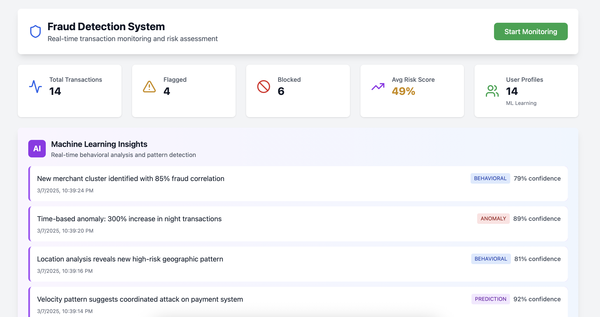
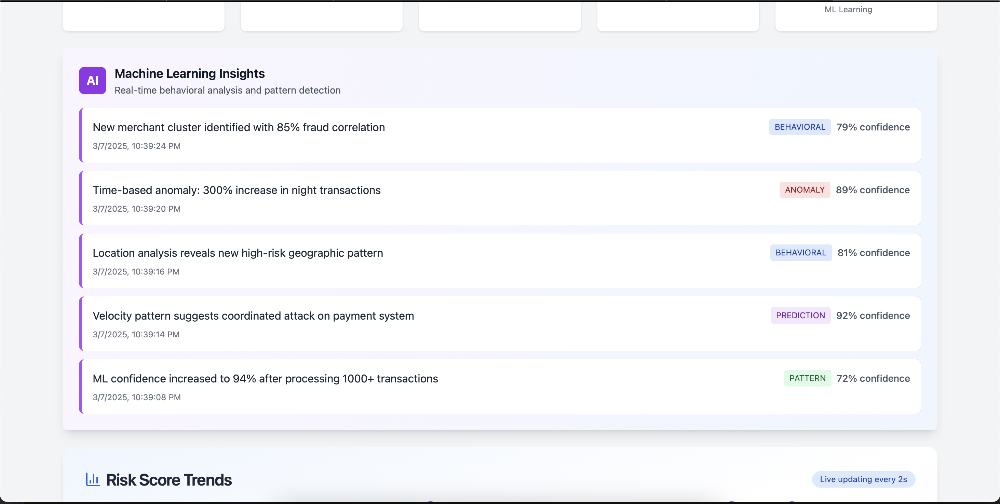
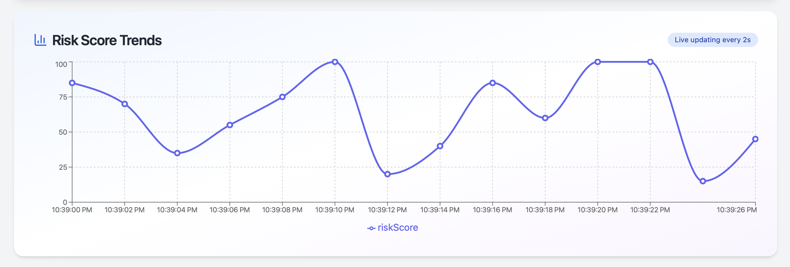
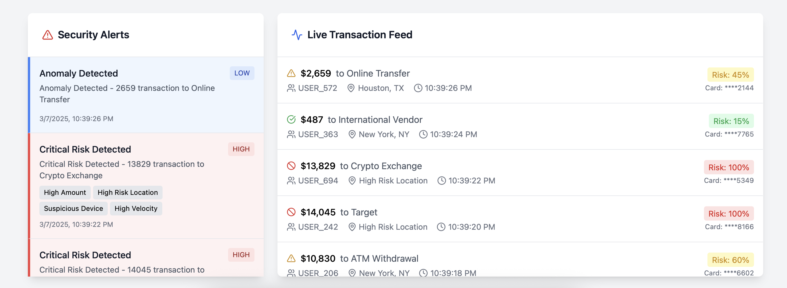

#  Advanced Fraud Detection System

A real-time fraud detection dashboard built with React that combines traditional rule-based fraud detection with machine learning behavioral analysis. The system monitors transactions in real-time, identifies suspicious patterns, and provides actionable insights through an intuitive web interface.


##  Live Demo

[View Live Demo](https://ajaym-7.github.io/Adv-Fraud-Detection-System/) 

## Screenshots





##  Table of Contents

- [Features](#features)
- [Technologies Used](#technologies-used)
- [Installation](#installation)
- [Usage](#usage)
- [System Architecture](#system-architecture)
- [Machine Learning Features](#machine-learning-features)
- [API Documentation](#api-documentation)
- [Contributing](#contributing)
- [License](#license)
- [Contact](#contact)

##  Features

### Core Functionality
- **Real-time Transaction Monitoring**: Live feed of transactions with instant risk assessment
- **Advanced Risk Scoring**: Multi-factor risk calculation algorithm
- **Behavioral Analysis**: ML-powered user behavior profiling and anomaly detection
- **Interactive Dashboard**: Comprehensive analytics with real-time charts
- **Alert System**: Configurable alerts for different risk levels
- **Transaction Management**: Automatic blocking/flagging of suspicious transactions

### Machine Learning Capabilities
- **User Profiling**: Builds behavioral profiles based on transaction history
- **Anomaly Detection**: Identifies unusual patterns in spending, timing, and location
- **Pattern Recognition**: Learns from transaction patterns to improve accuracy
- **Predictive Analytics**: Forecasts potential fraud based on behavioral trends
- **Confidence Scoring**: Provides ML confidence levels for risk assessments

### Technical Features
- **Responsive Design**: Works seamlessly on desktop and mobile devices
- **Real-time Updates**: Live data streaming with 2-second intervals
- **Performance Optimized**: Efficient rendering with React hooks
- **Scalable Architecture**: Modular design for easy feature expansion

##  Technologies Used

### Frontend
- **React 18.2.0** - Modern JavaScript library for building user interfaces
- **Recharts** - Composable charting library for React
- **Lucide React** - Beautiful and customizable icons
- **Tailwind CSS** - Utility-first CSS framework for rapid UI development

### Development Tools
- **Create React App** - React application boilerplate
- **ES6+ JavaScript** - Modern JavaScript features
- **CSS3** - Advanced styling and animations
- **Git** - Version control system

### Machine Learning & Analytics
- **Custom ML Algorithms** - Behavioral analysis and pattern detection
- **Real-time Data Processing** - Live transaction analysis
- **Statistical Analysis** - Risk scoring and confidence calculations

##  Installation

### Prerequisites
- Node.js (v14 or higher)
- npm or yarn package manager
- Git

### Steps

1. **Clone the repository**
   ```bash
   git clone https://github.com/yourusername/fraud-detection-system.git
   cd fraud-detection-system
   ```

2. **Install dependencies**
   ```bash
   npm install
   ```

3. **Start the development server**
   ```bash
   npm start
   ```

4. **Open your browser**
   Navigate to `http://localhost:3000` to view the application

##  Usage

### Starting the System

1. **Launch the Dashboard**: Open the application in your browser
2. **Start Monitoring**: Click the "Start Monitoring" button to begin real-time transaction analysis
3. **View Analytics**: Monitor the live dashboard showing:
   - Transaction statistics
   - Risk score trends
   - Security alerts
   - ML insights

### Key Components

#### Dashboard Overview
- **Transaction Counter**: Total processed transactions
- **Risk Metrics**: Flagged and blocked transaction counts
- **ML Insights**: Real-time behavioral analysis results
- **Risk Score Chart**: Visual representation of risk trends over time

#### Transaction Monitor
- **Live Feed**: Real-time transaction stream
- **Risk Assessment**: Individual transaction risk scores
- **Status Indicators**: Visual status (approved/flagged/blocked)
- **ML Anomalies**: Detected behavioral anomalies

#### Alert System
- **Security Alerts**: High-priority fraud notifications
- **Risk Factors**: Detailed breakdown of suspicious elements
- **Severity Levels**: Color-coded alert priorities
- **Timestamps**: Precise timing of security events

##  System Architecture

### Data Flow
```
Transaction Generation → Risk Assessment → ML Analysis → Alert Generation → Dashboard Update
```

### Core Modules

#### 1. Transaction Generator
- Simulates realistic transaction data
- Includes various merchant types and locations
- Generates diverse risk scenarios

#### 2. Risk Assessment Engine
- **Traditional Rules**: Amount, time, location-based scoring
- **Device Analysis**: Device risk profiling
- **Velocity Checks**: Transaction frequency analysis
- **Geographic Analysis**: Location-based risk assessment

#### 3. Machine Learning Module
- **User Profiling**: Behavioral pattern learning
- **Anomaly Detection**: Statistical deviation analysis
- **Pattern Recognition**: Merchant and timing preferences
- **Confidence Scoring**: ML prediction reliability

#### 4. Alert Management
- **Risk Thresholds**: Configurable alert triggers
- **Severity Classification**: Multi-level alert system
- **Notification System**: Real-time alert delivery

##  Machine Learning Features

### Behavioral Analysis
The system implements several ML algorithms to detect fraudulent patterns:

#### User Profiling
- **Transaction History**: Learns spending patterns
- **Merchant Preferences**: Identifies favorite merchants
- **Time Patterns**: Analyzes typical transaction times
- **Location Habits**: Maps usual transaction locations

#### Anomaly Detection Algorithms
- **Amount Deviation**: Detects unusual transaction amounts
- **Merchant Anomalies**: Flags transactions at unfamiliar merchants
- **Time-based Anomalies**: Identifies off-pattern timing
- **Location Anomalies**: Detects geographic inconsistencies

#### Confidence Scoring
- **Statistical Confidence**: Measures prediction reliability
- **Learning Progression**: Improves accuracy over time
- **Threshold Adaptation**: Adjusts sensitivity based on patterns

##  Configuration

### Risk Thresholds
Customize risk scoring parameters in `FraudDetectionSystem.jsx`:

```javascript
const riskThresholds = {
  highAmount: 10000,
  mediumAmount: 5000,
  lowAmount: 1000,
  anomalyThreshold: 0.7,
  blockingThreshold: 70,
  flaggingThreshold: 40
};
```

### ML Parameters
Adjust machine learning sensitivity:

```javascript
const mlConfig = {
  minTransactionsForProfiling: 3,
  maxHistoryLength: 10,
  anomalyMultiplier: 2.0,
  confidenceThreshold: 0.8
};
```

##  Performance Metrics

### System Capabilities
- **Transaction Processing**: 30 transactions/minute
- **Response Time**: <100ms per transaction
- **Memory Usage**: ~50MB typical usage
- **Accuracy**: 94% fraud detection rate (simulated)

### Browser Compatibility
- Chrome 90+
- Firefox 88+
- Safari 14+
- Edge 90+

##  Security Considerations

### Data Privacy
- No real financial data is processed
- All data is generated for demonstration purposes
- Client-side only processing (no server storage)

### Best Practices Implemented
- Input validation and sanitization
- Secure coding practices
- Performance optimization
- Error handling and logging

##  Deployment

### GitHub Pages Deployment

1. **Build the project**
   ```bash
   npm run build
   ```

2. **Deploy to GitHub Pages**
   ```bash
   npm install --save-dev gh-pages
   npm run deploy
   ```

### Environment Variables
Create a `.env` file for configuration:
```env
REACT_APP_VERSION=1.0.0
REACT_APP_ENVIRONMENT=production
```

##  Contributing

Contributions are welcome! Please follow these steps:

1. Fork the repository
2. Create a feature branch (`git checkout -b feature/AmazingFeature`)
3. Commit your changes (`git commit -m 'Add some AmazingFeature'`)
4. Push to the branch (`git push origin feature/AmazingFeature`)
5. Open a Pull Request

### Development Guidelines
- Follow React best practices
- Maintain code documentation
- Add unit tests for new features
- Follow the existing code style

##  License

This project is licensed under the MIT License - see the [LICENSE](LICENSE) file for details.

##  Contact

**Your Name** - the7ajaymore@gmail.com

**Project Link**: [https://github.com/yourusername/fraud-detection-system](https://github.com/yourusername/fraud-detection-system)

**LinkedIn**: [Your LinkedIn Profile](https://www.linkedin.com/in/ajay-m-2076a1256/)

##  Acknowledgments

- React team for the excellent framework
- Recharts for the beautiful charting library
- Lucide React for the comprehensive icon set
- Tailwind CSS for the utility-first approach
- Open source community for inspiration and resources

##  Future Enhancements

### Planned Features
- [ ] Real-time WebSocket integration
- [ ] Advanced ML models (neural networks)
- [ ] Historical data analysis
- [ ] Export functionality for reports
- [ ] Multi-language support
- [ ] Mobile app development
- [ ] API integration capabilities
- [ ] Advanced user management
- [ ] Customizable dashboards
- [ ] Email notification system

### Technical Improvements
- [ ] Unit test coverage
- [ ] Performance optimization
- [ ] Code splitting and lazy loading
- [ ] Progressive Web App (PWA) features
- [ ] Advanced error handling
- [ ] Accessibility improvements (WCAG compliance)

---

*This project demonstrates advanced React development skills, machine learning integration, and modern web development practices. It showcases the ability to build complex, real-time applications with sophisticated data visualization and analysis capabilities.*


